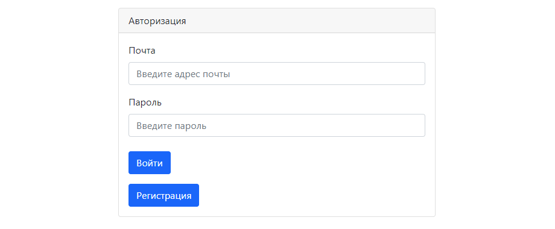
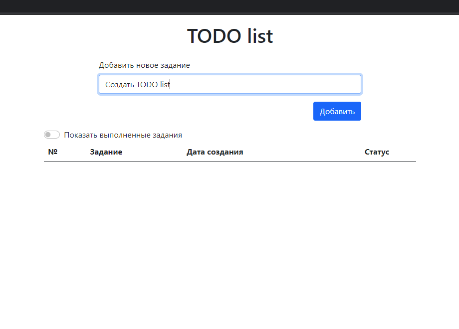
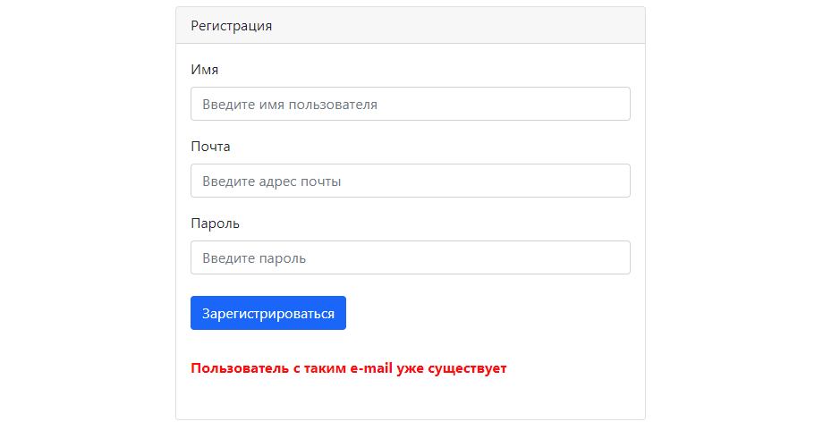

# Проект "TODO-list"

* [Описание](#описание)
* [Функционал](#функционал)
* [Технологии](#технологии)
* [Интерфейс](#интерфейс)
* [Автор](#автор)

## Описание
Приложение представляет собой список заданий, которые нужно выполнить.
Для хранения данных применяется Hibernate. 
Данные загружаются на страницу с помощью AJAX-запросов к Java сервлетам, которые возвращают данные в формате JSON.
Все изменения списка производятся динамически, без перезагрузки страницы.

## Функционал
* Добавление заданий в TODO-list
* Возможность пометить задание как выполненное
* Вывод только незавершённых заданий
* Вывод всех заданий

## Технологии
* Java14
* Servlets
* PostgreSQL
* Hibernate
* Apache Tomcat Server
* Travis CI
* Checkstyle
* AJAX
* jQuery
* Bootstrap

## Интерфейс
Попробуем добавить задание ничего не введя в поле ввода

Введём задание

Нажмём кнопку "Добавить"

Отметим выполненные задания с помощью чекбоксов "Статус" и нажмём на чекбокс "Показать выполненные задания"

Для того чтобы скрыть выполненные задания, нажмём на чекбокс "Показать выполненные задания" ещё раз

## Автор

Тимофеев Вадим Витальевич

Java разработчик

vadimstr102@gmail.com
