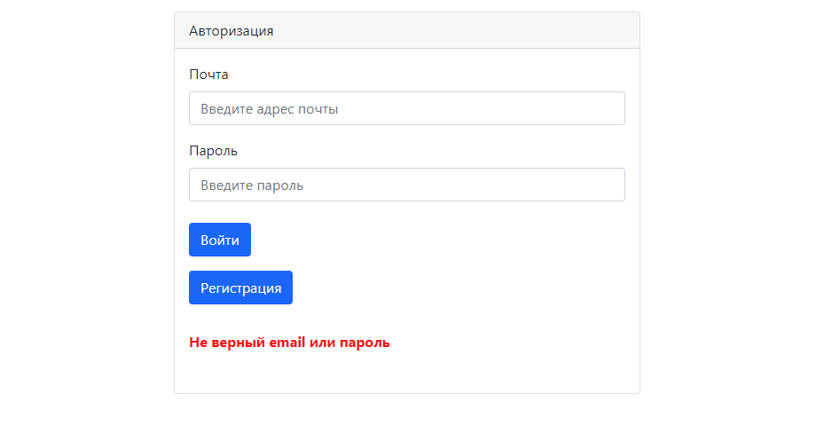
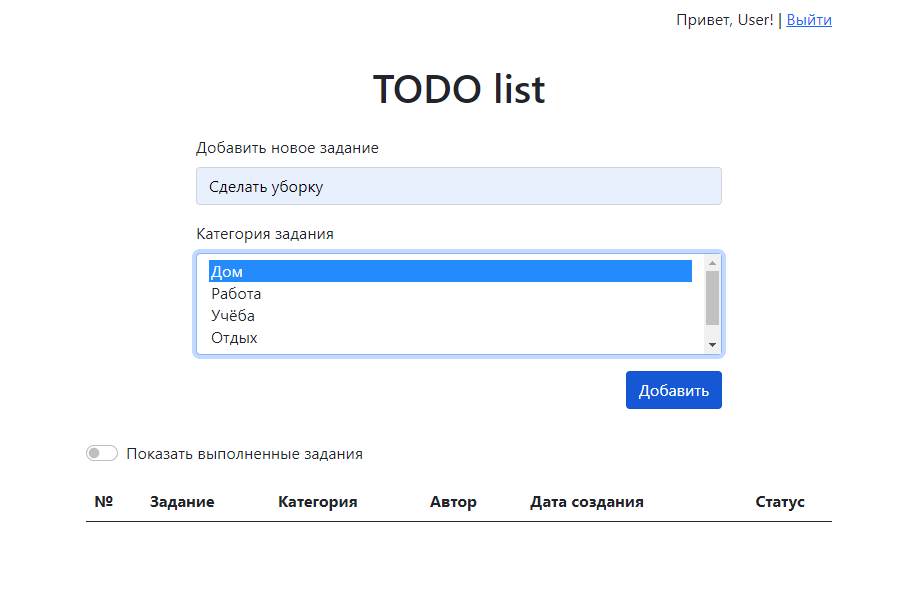

# Проект "TODO-list"

* [Описание](#описание)
* [Функционал](#функционал)
* [Технологии](#технологии)
* [Интерфейс](#интерфейс)
* [Автор](#автор)

## Описание
Приложение представляет собой список заданий, которые нужно выполнить.
Для хранения данных применяется PostgreSQL и Hibernate. 
Данные загружаются на страницу с помощью AJAX-запросов к Java-сервлетам,
которые возвращают данные в формате JSON.

## Функционал
* Регистрация и авторизация пользователя
* Добавление заданий в TODO-list
* Выбор категории задания
* Возможность пометить задание как выполненное
* Вывод на страницу всех заданий
* Вывод на страницу только незавершённых заданий

## Технологии
* Java 14
* Servlets
* PostgreSQL
* Hibernate
* Apache Tomcat Server
* Travis CI
* Checkstyle
* AJAX
* jQuery
* Bootstrap

## Интерфейс
Начальная страница представляет собой форму авторизации

При попытке авторизоваться под несуществующим аккаунтом выводится оповещение

Нажав на кнопку "Регистрация", попадаем на страницу регистрации. При вводе уже зарегистрированного
e-mail, так же выводится оповещение

Регистрируемся и попадаем на главную страницу

Вводим задание, выбираем одну или несколько категорий

Нажимаем на кнопку "Добавить", задание помещается в таблицу

В таблице отображаются задания всех пользователей.
Добавим ещё несколько заданий под разными аккаунтами

Чтобы отметить задание как выполненное, нужно нажать на чекбокс в колонке "Статус".
Отметим первые два задания, они исчезнут из таблицы. Для того, чтобы просмотреть выполненные
задания, нужно нажать на чекбокс "Показать выполненные задания".

При нажатии на кнопку "Выйти" происходит удаление пользователя из сессии и перенаправление на
страницу авторизации.

## Автор

Тимофеев Вадим Витальевич

Java разработчик

vadimstr102@gmail.com
